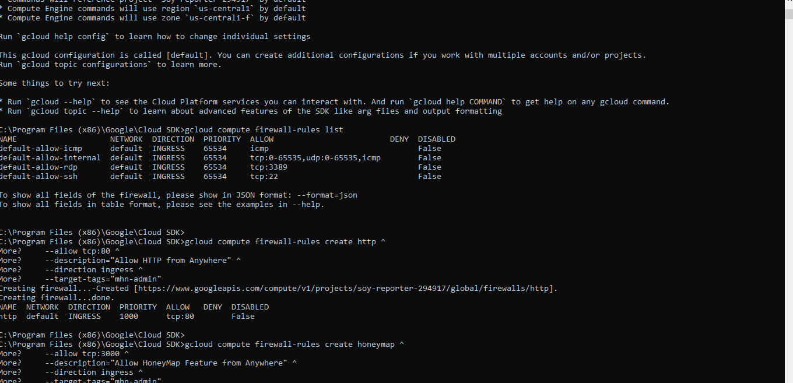
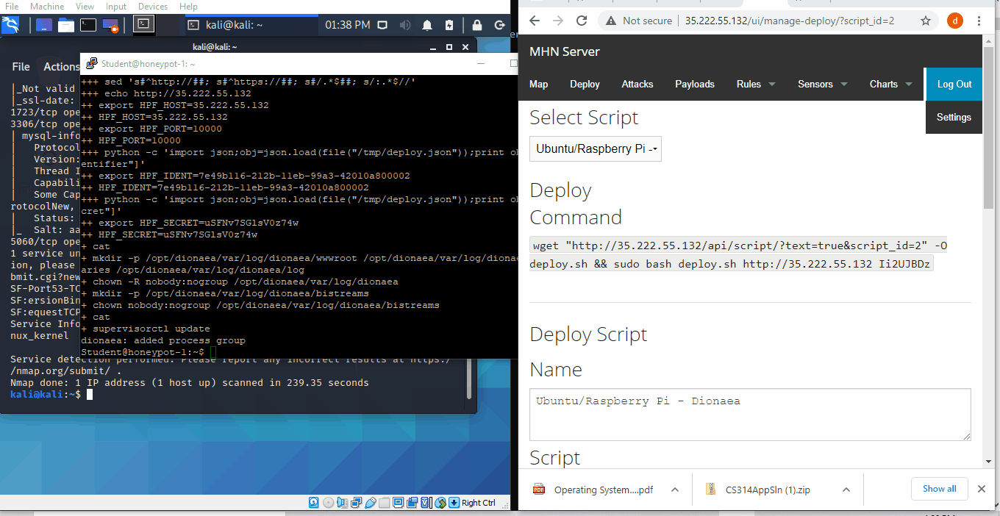
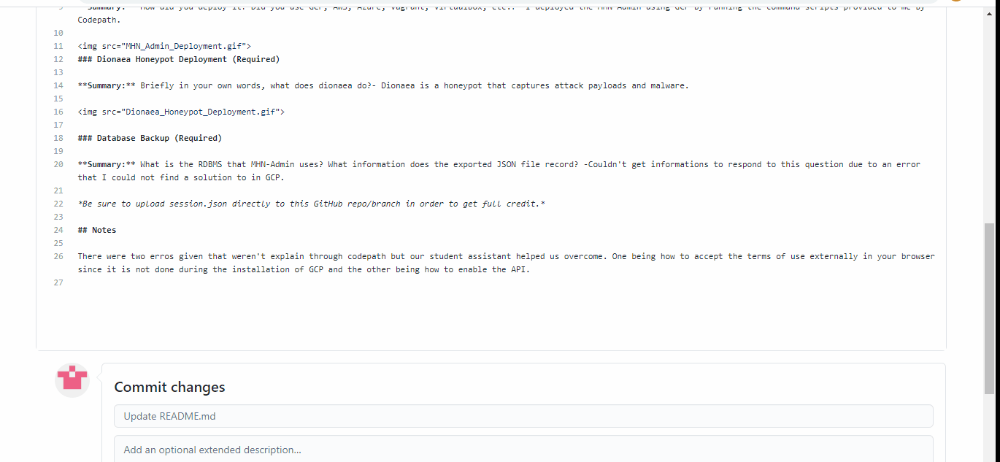

# Honeypot Assignment

**Time spent:** **4** hours spent in total

**Objective:** Create a honeynet using MHN-Admin. Present your findings as if you were requested to give a brief report of the current state of Internet security. Assume that your audience is a current employer who is questioning why the company should allocate anymore resources to the IT security team.

### MHN-Admin Deployment (Required)

**Summary:** How did you deploy it? Did you use GCP, AWS, Azure, Vagrant, VirtualBox, etc.?- I deployed the MHN-Admin using GCP by running the command scripts provided to me by Codepath.

### Dionaea Honeypot Deployment (Required)

**Summary:** Briefly in your own words, what does dionaea do?- Dionaea is a honeypot that captures attack payloads and malware.

### Database Backup (Required) 

**Summary:** What is the RDBMS that MHN-Admin uses? What information does the exported JSON file record? -Couldn't get informations to respond to this question due to an error that I could not find a solution to in GCP.

*Be sure to upload session.json directly to this GitHub repo/branch in order to get full credit.*

## Notes

There were two erros given that weren't explain through codepath but our student assistant helped us overcome. One being how to accept the terms of use externally in your browser since it is not done during the installation of GCP and the other being how to enable the API. The other being an access denied error when trying to use the following command script for database back up "mongoexport --db mnemosyne --collection session > session.json".
